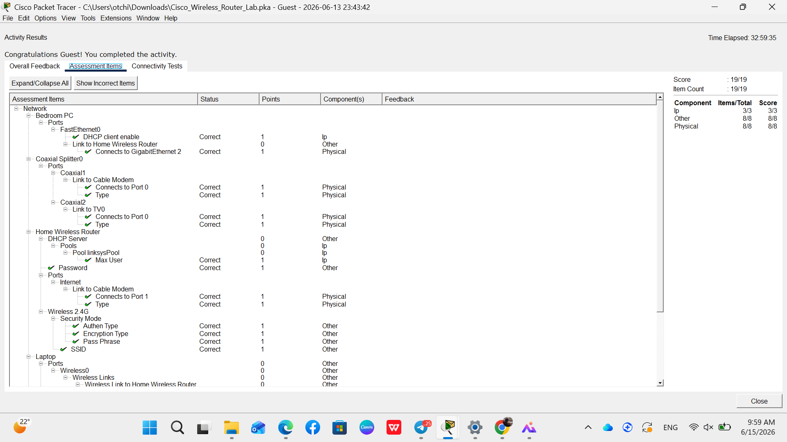

# Secure Wireless Router & Client Configuration Lab

## 📌 Project Overview
This hands-on network security lab demonstrates the deployment, architecture hardening, and security baselining of a Small Office/Home Office (SOHO) network environment using **Cisco Packet Tracer**. The project models a complete physical-to-logical infrastructure setup, ensuring secure data transit and endpoint authentication.

* 📂 **Full Project Repository:** [Click Here to View Main Repository](Cisco-Network-Security-Labs)

---

## 🛠️ Network Architecture & Design
The infrastructure simulates a modern connected network consisting of:
* **Edge Gateway:** Home Wireless Router functioning as a DHCP server and firewall gateway.
* **Wired Endpoints:** Office PC and Bedroom PC deployed via FastEthernet/GigabitEthernet copper infrastructure.
* **Wireless Client:** Living room Laptop utilizing 2.4 GHz IEEE 802.11n standards.
* **WAN Link:** Coaxial-to-Digital signaling migration through a Splitter and Cable Modem mapping to the external `skillsforall.srv` server.

🔗 **Architecture Blueprint:** [View Network Topology Diagram](topology.png)

---

## 🔒 Implemented Security Benchmarks (Key Milestones)

### 1. DHCP Pool Hardening & Attack Surface Reduction
* **Configuration:** Restricted the automated DHCP lease capacity by defining the `Maximum Number of Users` to exactly **10 active leases**.
* **SOC Impact:** Minimizes the local corporate network attack surface against unauthorized asset attachment and Rogue DHCP insertion.

### 2. Wireless LAN (WLAN) Cryptographic Enforcement
* **SSID Customization:** Migrated the broadcast identity from `Default` to a customized domain identifier `MyHome`.
* **Encryption Standard:** Enforced **WPA2 Personal (WPA2-PSK)** advanced encryption protocol on the 2.4 GHz radio frequency.
* **Pre-Shared Key (PSK):** Deployed a strong, complex passphrase `MyPassPhrase1!` to mitigate Wi-Fi brute-force and dictionary attacks.

### 3. Identity and Access Management (IAM) Basics
* Updated factory-default administrative credentials from `admin/admin` to a secure configuration password standard (`MyPassword1!`) to block unauthorized device management access.

---

## 🔬 Validation & Convergence Verification
* Successfully achieved a verification compliance score of **19/19 (100% Complete)**.
* Validated end-to-end routing connectivity by initiating HTTP web resource requests from both wired and wireless endpoints to the external target `skillsforall.srv`.

### 📸 Verification Evidence

